WeensyOS and Virtual Memory
===========================

<details>
<summary>WeensyOS Overview</summary>

WeensyOS is a teaching operating system built for Harvard's
[CS 61].

Quickstart: `make run` will run the OS using the [QEMU] emulator.

Running the OS
--------------

`make run` will run the OS. Close the QEMU window, or type `q` inside
it, to exit the OS.

`make run-console` will run the OS in the console window.

WeensyOS creates a debug log in `log.txt`. Run `make LOG=stdio run` to
redirect the debug log to the standard output, or `make
LOG=file:FILENAME run` to redirect it to `FILENAME`.

Run `make D=1 run` to ask QEMU to print verbose information about interrupts
and CPU resets to the standard error. This setting will also cause QEMU to
quit after encountering a [triple fault][] (normally it will reboot).

Finally, run `make clean` to clean up your directory.

Building
--------

**Linux:** WeensyOS should build natively on a Linux machine or
virtual machine. `qemu` packages are required to run WeensyOS; on
Ubuntu, `sudo apt install qemu qemu-system-x86` should work. A recent
compiler is required. You can use [Clang](https://clang.llvm.org/),
but only version 5 or later.

**Mac OS X:** WeensyOS can build on Mac OS X after some tools are installed.

1. Install [Homebrew].

2. Install Homebrew's new GCC package: `brew install gcc`

3. Install Homebrew's QEMU: `brew install qemu`
4. Tap [Sergio Benitez's collection of cross-compilers](https://github.com/SergioBenitez/homebrew-osxct): `brew tap SergioBenitez/osxct`

5. Install the `x86_64-unknown-linux-gnu` cross-compiler toolchain: `brew install x86_64-unknown-linux-gnu`

6. Create a file `config.mk` in this directory containing this:

    ```make
    CCPREFIX=x86_64-unknown-linux-gnu-
    HOSTCC=gcc-8
    HOSTCXX=g++-8
    ```

    (Do not `git add config.mk`: it is intended for local configuration.)

Troubleshooting
---------------

There are several ways to kill a recalcitrant QEMU (for instance, if your
OS has become unresponsive).

* If QEMU is running in its own graphical window, then close the window. This
  will kill the embedded OS.

* If QEMU is running in a terminal window (in Docker, for instance), then
  press `Alt-2`. This will bring up the QEMU Monitor, which looks like this:

    ```
    compat_monitor0 console
    QEMU 4.2.0 monitor - type 'help' for more information
    (qemu)
    ```

    Type `quit` and hit Return to kill the embedded OS and return to your
    shell. If this leaves the terminal looking funny, enter the `reset` shell
    command to restore it.

    If `Alt-2` does not work, you may need to configure your terminal to
    properly send the Alt key. For instance, on Mac OS X's Terminal, go to
    Terminal > Preferences > Keyboard and select "Use Option as Meta key". You
    can also configure a special keyboard shortcut that sends the `Escape 2`
    sequence.

Run `make run-gdb` to start up the OS with support for GDB debugging.
This will start the OS, but not GDB. You must run `gdb -x
build/weensyos.gdb` to connect to the running emulator; when GDB
connects, it will stop the OS and wait for instructions.

If you experience runtime errors involving `obj/libqemu-nograb.so.1`, put
`QEMU_PRELOAD_LIBRARY=` in `config.mk`. This disables a shim we use that
prevents QEMU from grabbing the mouse.

Source files
------------

Real operating systems are big. We have tried to boil down this OS to
a minimum, comment it to help you, and separate x86-64 specifics from
more fundamental issues.

### Common files

| File            | Description                            |
| --------------- | -------------------------------------- |
| `types.h`       | Type definitions                       |
| `lib.hh/cc`     | C library                              |
| `x86-64.h`      | x86-64 hardware definitions            |
| `elf.h`         | ELF64 structures for loading programs  |

### Boot loader

| File             | Description                  |
| ---------------- | ---------------------------- |
| `bootentry.S`    | Boot loader entry point      |
| `boot.cc`        | Boot loader main code        |
| `build/boot.ld`  | Boot loader linker script    |

### Kernel core

| File                | Description                          |
| ------------------- | ------------------------------------ |
| `kernel.hh`         | Kernel declarations                  |
| `k-exception.S`     | Kernel entry points                  |
| `k-hardware.cc`     | Kernel initialization and hardware   |
| `k-vmiter.hh/cc`    | Page table iterators                 |
| `kernel.cc`         | Kernel exception handlers            |
| `k-memviewer.cc`    | Kernel memory viewer                 |
| `build/kernel.ld`   | Kernel linker script                 |

### Kernel libraries

| File                | Description                          |
| ------------------- | ------------------------------------ |
| `k-apic.hh`         | Interrupt controller hardware        |
| `k-pci.hh`          | PCI bus hardware                     |

### Processes

| File               | Description                                      |
| ------------------ | ------------------------------------------------ |
| `u-lib.cc/hh`      | Process library and system call implementations  |
| `p-*.cc`           | Process code                                     |
| `build/process.ld` | Process binary linker script                     |

Build files
-----------

The main output of the build process is a disk image,
`weensyos.img`. QEMU "boots" off this disk image, but the image
could conceivably boot on real hardware! The build process also
produces other files that can be useful to examine.

| File                       | Description                          |
| -------------------------- | ------------------------------------ |
| `obj/kernel.asm`           | Kernel assembly (with addresses)     |
| `obj/kernel.sym`           | Kernel defined symbols               |
| `obj/p-PROCESS.asm`, `sym` | Same for process binaries            |

[triple fault]: https://en.wikipedia.org/wiki/Triple_fault
[CS 61]: https://cs61.seas.harvard.edu/
[QEMU]: https://qemu.org/
[Homebrew]: https://brew.sh/

</details>

Assignment
----------

In this assignment, you implement process memory isolation, virtual
memory, and some system calls in a tiny operating system. This will
introduce you to virtual memory and operating system design.


Initial state
--------------

For this assignment, there is no handy `make test` functionality.
Instead, you should run your instance of WeensyOS and visually compare
it to the images you see below in the assignment.


Run `make run` in your project directory. You should see something like this,
which shows four related `p-allocator` processes running in parallel:


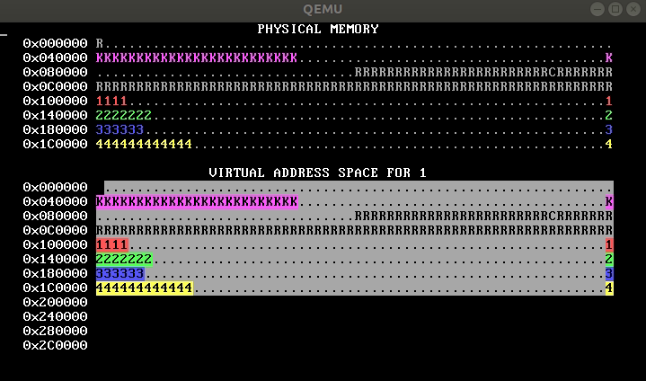


This image loops forever; in an actual run, the bars will move to the
right and stay there. Don't worry if your image has different numbers of
K's or otherwise has different details.


If your bars run painfully slowly, edit the `p-allocator.cc` file and reduce
the `ALLOC_SLOWDOWN` constant. **Stop now to read and understand
`p-allocator.cc`.**


Here's what's going on in the physical memory display.


- WeensyOS displays the current state of physical and virtual memory.
Each character represents 4 KiB of memory: a single page. There are 2
MiB of physical memory in total. (How many pages is this?)
- WeensyOS runs four processes, 1 through 4. Each process runs a different
program. The four programs are compiled from the same source code
(`p-allocator.cc`), but for each program the compiler is told to use a
different region of memory for its text and data segments.
- Each process asks the kernel for more heap space, one page at a time,
until it runs out of room. Each process's heap begins just above its code
and global data, and ends just below its stack. The processes allocate
space at different rates: compared to Process 1, Process 2 allocates space
twice as quickly, Process 3 goes three times faster, and Process 4 goes
four times faster. (A random number generator is used, so the exact rates
may vary.) The marching rows of numbers show how quickly the heap spaces
for processes 1, 2, 3, and 4 are allocated.

Here are two labeled memory diagrams, showing what the characters mean
and how memory is arranged.


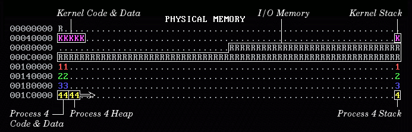


The virtual memory display is similar.

- The virtual memory display cycles between the four processes'
address spaces. However, all the address spaces are the same for
now.
- Blank spaces in the virtual memory display correspond to unmapped
addresses. If a process (or the kernel) tries to access such an
address, the processor will page fault.
- The character shown at address X in the virtual memory display
identifies the owner of the corresponding *physical* page.
- In the virtual memory display, a character is reverse video
if an application process is allowed to access the corresponding
address. Initially, *any* process can modify *all* of
physical memory, including the kernel. Memory is not properly
isolated.

Goal
----

You will implement complete and correct memory isolation for WeensyOS
processes. Then you'll implement full virtual memory, which will improve
utilization. You'll implement fork (creating new processes at runtime) and
exit (destroying processes at runtime).


We need to provide a lot of support code for this assignment, but the code you
write will all go in `kernel.cc`.

Notes
-----

### Running WeensyOS

If QEMU's default display causes accessibility problems, you will want to run
`make run-console`.


There are several ways to debug WeensyOS.

- Add `log_printf` statements to your code (the output of `log_printf` is written to the file `log.txt`).
- Use assertions to catch problems early (for instance, call `check_page_table` to test a page table for obvious issues, or add your own).
- Sometimes a mistake will cause the OS to crash hard and reboot. Use `make D=1 run > debuglog.txt` to get additional, painfully-verbose debugging output. Search through `debuglog.txt` for `check_exception` lines to see where the exceptions occur.
- A powerful, yet simple, technique for debugging extreme crashes is to narrow down where they occur using infinite loops. Add an infinite loop (`while (true) {}`) to your kernel. If the resulting kernel crashes, then the infinite loop is *after* the crash point; if it infinite loops, then the infinite loop is *before* the crash point.
- Printouts such as assertions and fault reports include the virtual address of the faulting instruction, but they do not always include symbol information. Use files `obj/kernel.asm` (for the kernel) and `obj/p-PROCESSNAME.asm` (for processes) to map instruction addresses to instructions.

### Memory system layout

WeensyOS memory system layout is described by several constants.

| Constant            | Description                    |
| ------------------- | ------------------------------ |
| `KERNEL_START_ADDR` | Start of kernel code.
| `KERNEL_STACK_TOP`  | Top of kernel stack. The kernel stack is one page long.
| `CONSOLE_ADDR`      | CGA console memory.
| `PROC_START_ADDR`   | Start of application code. Applications should not be able to access memory below `PROC_START_ADDR`, except for the single page at `console`.
| `MEMSIZE_PHYSICAL`  | Size of physical memory in bytes. WeensyOS does not support physical addresses >= `MEMSIZE_PHYSICAL`. Equals 0x200000 (2MB).
| `MEMSIZE_VIRTUAL`   | Size of virtual memory. WeensyOS does not support virtual addresses >= `MEMSIZE_VIRTUAL`. Equals 0x300000 (3MB).
| `PAGESIZE`          | Size of a memory page. Equals 4096 (or, equivalently, `1 << 12`).
| `PAGEOFFMASK`       | Mask for the offset portion of an address. Equals 4095 (`PAGESIZE - 1`). If `(a & PAGEOFFMASK) == 0`, then `a` is page-aligned.

### Kernel and process address spaces

WeensyOS begins with the kernel and all processes sharing a single address space. This is defined by the `kernel_pagetable` page table. `kernel_pagetable` is initialized to the *identity mapping*: virtual address X maps to physical address X.


As you work through the pset, you will shift processes to use
independent address spaces, where each process can access only a
subset of physical memory.


The kernel, though, still needs the ability to access all of physical memory.
Therefore, all kernel functions run using the `kernel_pagetable` page table.
Thus, in kernel functions, each virtual address maps to the physical address
with the same number. The `exception_entry` and `syscall_entry` assembly codes
explicitly install `kernel_pagetable` when they begin, and `exception_return`
and the `syscall` return path install the process's page table as they exit.


Each process page table *must* contain kernel mappings for the kernel stack
and for the `exception_entry` and `syscall_entry` code paths.

Step 1: Kernel isolation
------------------------

WeensyOS processes could stomp all over the kernel's memory if they wanted. Better stop that. Change `kernel_start`, the kernel initialization function, so that kernel memory is inaccessible to applications - except for the memory holding the CGA console (the single page at `CONSOLE_ADDR == 0x0B8000`).


When you are done, WeensyOS should look like this. In the virtual map, kernel memory is no longer reverse-video, since the user can't access it. Note the lonely CGA console memory block.


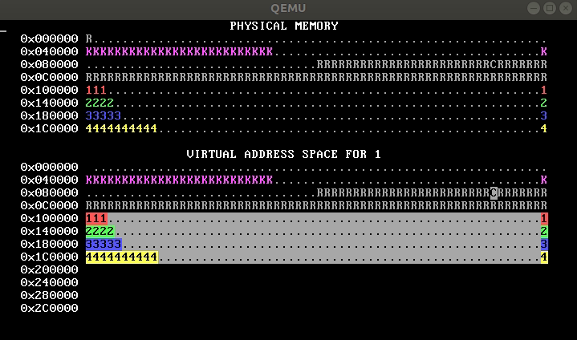


Use `vmiter` to create memory mappings. Start from the `vmiter` loop in the `kernel_start` function.

<details>
<summary>About virtual memory iterators (`vmiter`)</summary>

The `vmiter` class examines and modifies x86-64 page tables, especially
their virtual-to-physical address mappings.

### Examining page tables

`vmiter(pt, va)` creates a `vmiter` object examining page table `pt`
and with current virtual address `va`.

The `va` method returns the iterator's current virtual address.

The `pa` method returns the physical address mapped at the current virtual
address:

```c
x86_64_pagetable* pt = ...;
uintptr_t pa = vmiter(pt, va).pa();    // returns uintptr_t(-1) if unmapped
```

The `kptr` method returns a pointer corresponding to the physical address. Use this method if you need to examine the physical memory located at `va`, or you need to pass that memory to `kfree`. If the virtual address is mapped, then `kptr`'s address value is the same as `pa` (because the kernel is identity mapped). `kptr` returns `nullptr` if the virtual address is unmapped.


The `perm` method returns the permissions of the current mapping.

```c
if ((vmiter(pt, va).perm() & PTE_W) != 0) {
    // then `va` is present and writable in `pt`
}
```

`perm` returns a bitwise-or of flags, possibly including `PTE_P` (numeric value 1), `PTE_W` (numeric value 2), and `PTE_U` (numeric value 4). `PTE_P` marks **P**resent pages (pages that are mapped). `PTE_W` marks **W**ritable pages. `PTE_U` marks **U**ser-accessible pages - pages accessible to unprivileged processes. Kernel memory should be mapped with permissions `PTE_P|PTE_W`, which allows the kernel to read or write the memory, but prevents all access by processes.

(Note that `perm()`'s return value may include other bits than `PTE_P`, `PTE_W`, and `PTE_U`, because the processor automatically modifies some bits as it runs. There are convenient shorthands - `present()`, `writable()`, and `user()` - for `PTE_P`, `PTE_W`, and `PTE_U`.)

### Traversing page tables

The `find(va)` method changes the iterator's current virtual address to `va`. You can also say `it += DELTA`, which increments the current virtual address by `DELTA`.

It is common to use `vmiter` in loops. This loop prints all present mappings in the lower 64KiB of memory, moving one page at a time:

```c
for (vmiter it(pt, 0); it.va() < 0x10000; it += PAGESIZE) {
    if (it.present()) {
        log_printf("%p maps to %p with permissions %x\n",
                   it.va(), it.pa(), it.perm());
    }
}
```

### Modifying page tables

The `vmiter::map` and `try_map` functions *modify* mappings in a page table. This line maps physical page 0x3000 at virtual address 0x2000, with permissions P, W, and U:

```c
vmiter(pt, 0x2000).map(0x3000, PTE_P | PTE_W | PTE_U);
```

`vmiter::map` panics if it cannot add a mapping (this happens if it fails to allocate memory for a page table page). That's fine during boot time, when if memory allocation fails there's truly no recourse, but later it's important to check for and handle errors. Use `try_map` for this:

```c
int r = vmiter(pt, 0x2000).try_map(0x3000, PTE_P | PTE_W | PTE_U);
if (r < 0) {
    // there was an error; mappings remain unchanged
}
```

`vmiter::map` and `try_map` can change a mapping's permissions. This adds `PTE_W` to the permissions for virtual address `va`:

```c
vmiter it(pt, va);
assert(it.present());
it.map(it.pa(), it.perm() | PTE_W);
```

### Interface summary

```c
// `vmiter` walks over virtual address mappings.
// `pa()` and `perm()` read current addresses and permissions;
// `map()` and `try_map()` modify mappings.

class vmiter {
  public:
    // COMMON FUNCTIONS

    // Initialize a `vmiter` for `pt`, with initial virtual address `va`.
    inline vmiter(x86_64_pagetable* pt, uintptr_t va);
    inline vmiter(const proc* p, uintptr_t va);

    // Return current virtual address
    inline uintptr_t va() const;
    // Return physical address mapped at `va()`,
    // or `(uint64_t) -1` if `va()` is unmapped.
    inline uint64_t pa() const;
    // Return a kernel-accessible pointer corresponding to `pa()`.
    // This pointer can be dereferenced in the kernel.
    // Returns `nullptr` if `va()` is unmapped.
    template <typename T = void*>
    inline T kptr() const;

    // Return permissions of current mapping.
    // Returns 0 unless `PTE_P` is set.
    inline uint64_t perm() const;
    // Return true iff `va()` is present (`PTE_P`)
    inline bool present() const;
    // Return true iff `va()` is present and writable (`PTE_P|PTE_W`)
    inline bool writable() const;
    // Return true iff `va()` is present and unprivileged (`PTE_P|PTE_U`)
    inline bool user() const;

    // Advance to virtual address `va() + delta`; return `*this`
    inline vmiter& operator+=(intptr_t delta);
    // Advance to virtual address `va() - delta`; return `*this`
    inline vmiter& operator-=(intptr_t delta);


    // Map `pa` at the current virtual address with permissions `perm`.
    // The current virtual address must be page-aligned. Calls `kalloc`
    // to allocate page table pages if necessary; panics on failure.
    inline void map(uintptr_t pa, int perm);
    inline void map(void* kptr, int perm);

    // Map `pa` at the current virtual address with permissions `perm`.
    // The current virtual address must be page-aligned. Calls `kalloc`
    // to allocate page table pages if necessary; returns 0 on success
    // and -1 on failure.
    int try_map(uintptr_t pa, int perm);
    int try_map(void* kptr, int perm);


    // LESS COMMON FUNCTIONS

    // Return intersection of permissions in [va(), va() + sz)
    uint64_t range_perm(size_t sz) const;

    // Move to virtual address `va`; return `*this`
    inline vmiter& find(uintptr_t va);

    // Move to next larger page-aligned virtual address, skipping large
    // unmapped regions
    void next();
    // Move to `last_va()`
    void next_range();
};
```

</details>

In addition, make sure that your `sys_page_alloc` system call preserves kernel isolation: Applications shouldn't be able to use `sys_page_alloc` to screw up the kernel. This requires changes to the `SYSCALL_PAGE_ALLOC` case in `syscall`. Read the description of `sys_page_alloc` in `u-lib.hh` to get a feeling for the possible errors.

Step 2: Isolated address spaces
-------------------------------

Implement process isolation by giving each process its own independent page table. Your OS should look like this:


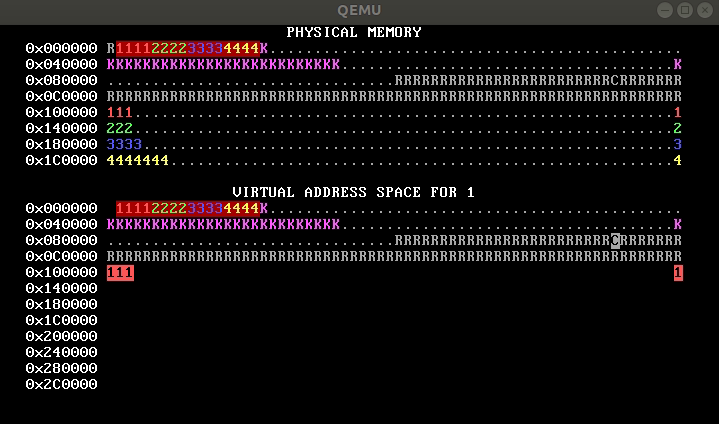

Each process only has permission to access its own pages, which you can tell because only its own pages are shown in reverse video.

How to implement per-process page tables in `process_setup`:

- Allocate a new, initially-empty page table for the process by calling `kalloc_pagetable`.
- Copy the mappings from `kernel_pagetable` into this new page table using `vmiter::map`. This ensures that the required kernel mappings are present in the new page table. You can do this using a loop with two `vmiter`s, or you can set the mappings yourself (they are identity mappings).
    - *Note*: `vmiter::map` will allocate page table pages as needed.
- Then you will need to make sure that any page that **belongs** to the process is mapped as user-accessible. These are the pages the process needs to access, including its code, data, stack, and heap segments. There are several places you'll need to change.

Note the diagram now has four pages for each process in the *kernel* area, starting at 0x1000. These are the four-level page tables for each process. (The colored background indicates that these pages contain kernel-private page table data, even though the pages "belong" to the process.) The first page was allocated explicitly in `process_setup`; the other pages were allocated by `vmiter::map` as the page table was initialized. 

One common solution, shown above, leaves addresses above `PROC_START_ADDR` totally unmapped by default, but other designs work too. As long as a virtual address mapping has no `PTE_U` bit, its process isolation properties  are unchanged. For instance, this solution, in which all mappings are present but accessible only to the kernel, also implements process isolation correctly:

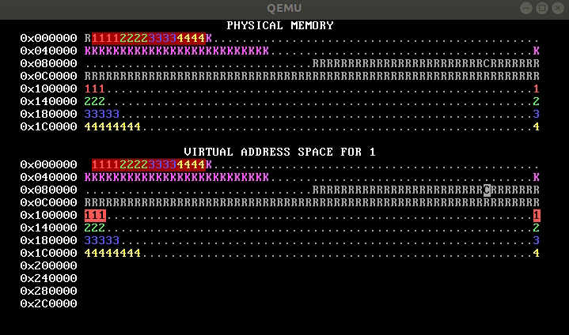

If you create an incorrect page table, WeensyOS might crazily reboot. Don't panic; see the debugging hints above.

<details>
<summary>About program images and segments (`program_image pgm`, `seg`)</summary>

A *program image* is the data generated by the compiler and linker that defines a program's initial state. It's essentially a recipe for constructing a process. It defines how the process's initial virtual address space should be organized, contains the instruction and data bytes that should be used to initialize that address space, and specifies which instruction byte is the first instruction to execute. Operating systems use program images to initialize new processes.

A *segment* is a region of process memory. Unix processes have text, data, heap, and stack segments. Most program image data consists of information about the segments that must be loaded into processes' initial memory state. (The operating system decides on the size and location of the stack segment itself, and the heap segment starts out empty.) You can print about a program image's segment definitions using `objdump -p`.

The WeensyOS kernel includes, as part of its kernel data, program images for all the processes it knows how to run - `p-allocator`, `p-allocator2`, `p-fork`, etc. The `program_image` and `program_image_segment` data types allow you to query these images. Their interfaces are as follows:

```c
struct program_image { ...
    // Return an iterator to the beginning loadable segment in the image.
    program_image_segment begin() const;
    // Return an iterator to the end loadable segment in the image.
    program_image_segment end() const;

    // Return the user virtual address of the entry point instruction.
    uintptr_t entry() const;
};

struct program_image_segment { ...
    // Return the user virtual address where this segment should be loaded.
    uintptr_t va() const;
    // Return the size of the segment, including zero-initialized space.
    size_t size() const;
    // Return a pointer to the kernel's copy of the initial segment data.
    const char* data() const;
    // Return the number of bytes of initial segment data.
    size_t data_size() const;
    // It is always true that `data_size() <= size()`. If `data_size() < size()`,
    // the remaining bytes must be initialized to zero.

    // Return true iff the segment is writable.
    bool writable() const;
};
```

For instance, this loop prints information about a program image.

```c
void log_program_info(const char* program_name) {
    program_image pgm(program_name);
    log_printf("program %s: entry point %p\n", program_name, pgm.entry());
    size_t n = 0;
    for (auto seg = pgm.begin(); seg != pgm.end(); ++seg, ++n) {
        log_printf("  segment %zu: addr %p, size %lu, data_size %lu, %s\n",
                   n, seg.va(), seg.size(), seg.data_size(),
                   seg.writable() ? "writable" : "not writable");
        if (seg.data_size() > 0) {
            log_printf("    first data byte: %u\n", (unsigned char) *seg.data());
        }
    }
}
```

The relationship between `seg.va()` and `seg.data()` is worth emphasizing. `seg.va()` is a *user virtual address*. It is the process virtual address where the process code expects the segment to be loaded. `seg.data()`, on the other hand, is a *kernel pointer*. It points into the program image data in the kernel. WeensyOS `seg.va()` values are all `>= PROC_START_ADDR` (0x100000), and are typically page-aligned, whereas `seg.data()` values are between 0x40000 and 0x80000 and are not aligned.

</details>

Step 3: Virtual page allocation
-------------------------------

So far, WeensyOS processes use *physical page allocation* for process memory:
Process code, data, stack, and heap pages with virtual address X always use
the physical pages with physical address X. This is inflexible and limits
utilization.


Change your operating system to allocate all process data, including
its code, globals, stack, and heap, using `kalloc` instead of direct access
to the `pages` array.


Here's how our OS looks after this step.


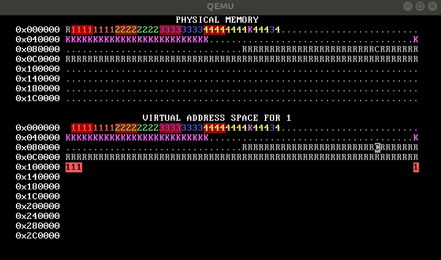


Virtual page allocation will complicate the code that initializes process code in `process_setup`. You'll need to figure out why (hint: which page table is in force in `process_setup`?) and find a way around it (hint: `vmiter` or `set_pagetable`).

Step 4: Overlapping address spaces
----------------------------------

Now the processes are isolated, which is awesome, but they're still not taking full advantage of virtual memory. Isolated address spaces can use *the same* virtual addresses for *different* physical memory. There's no need to keep the four process address spaces disjoint.


In this step, change each process's stack to grow down starting at address `0x300000 == MEMSIZE_VIRTUAL`. Now the processes have enough heap room to use up all of physical memory!


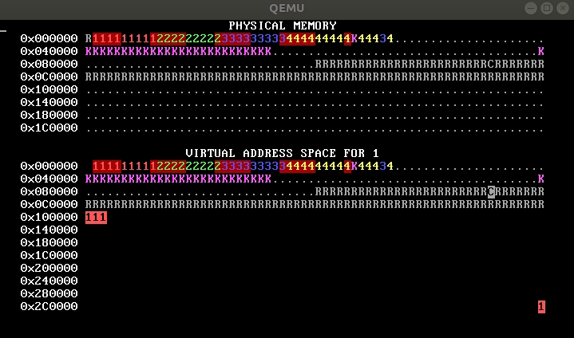

If there's no physical memory available, `sys_page_alloc` should return an error code to the calling process, such as -1. Do not kill the calling process! Lack of memory is a potentially recoverable problem. 

Step 5: Fork
------------

The `fork` system call starts a new process as a *copy* of an existing process. The process that calls `fork` is called the *parent process*, and the newly created copy is called the *child process*. The system call appears to return twice: it returns 0 to the child, and returns the child's process ID to the parent.

Run WeensyOS with `make run` or `make run-console`. At any time, press the `f` key. This will soft-reboot WeensyOS and ask it to run a single `p-fork` process, rather than the gang of `allocator`s. You should see something like this:


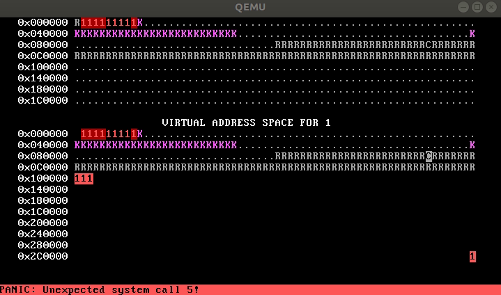

This is because you haven't implemented `fork` yet.

Implement `fork`.

- When a process calls `fork`, look for a free process slot in the `ptable[]` array for the child. Don't use slot 0. If no slot exists, return `-1` to the caller.
- If a free slot is found, copy the parent's page table for the child. For addresses below `PROC_START_ADDR` (0x100000), the parent and child page tables will have identical mappings (same physical addresses, same permissions). But for addresses at or above `PROC_START_ADDR`, the child's page table must map *different pages* that contain *copies* of any user-accessible, writable memory. This ensures process isolation: two processes should not share any writable memory except the console.
- So `fork` must examine every virtual address in the parent page table. Whenever the parent process has an application-writable, non-console page at virtual address `V`, then `fork` must allocate a new physical page `P`; copy the data from the parent's page into `P`, using `memcpy`; and finally map page `P` at address `V` in the child page table, using the permissions from the parent page table.
- The child process's registers are initialized as a copy of the parent process's registers, except for `reg_rax`. 

When you're done, you should see something like this after pressing `f`.


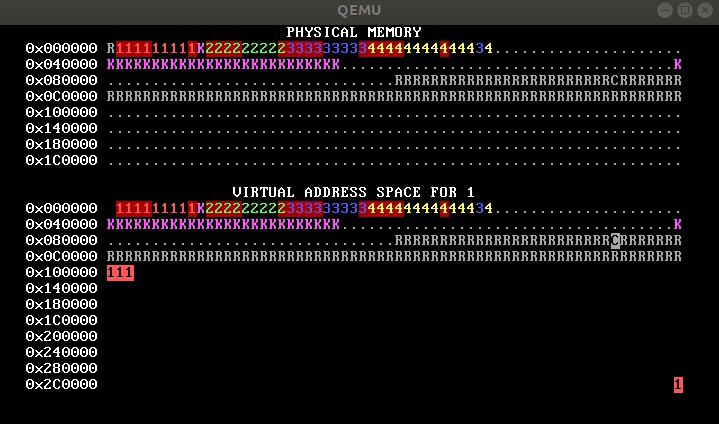

An image like this means you forgot to copy the data for some pages, so the processes are actually *sharing* stack and/or data pages:


Step 6: Freeing memory
----------------------

So far none of your test programs have ever freed memory or exited. Memory allocation's pretty easy until you add free! So let's add free by allowing applications to exit.


In this exercise you'll implement the `sys_exit` system call, which exits the current process. This exercise is a capstone since freeing memory will tend to expose weaknesses and problems in your other code.

To test your work, use `make run` and then type `e`. This reboots WeensyOS to run the `p-forkexit` program. (Initially it'll crash because `sys_exit()` isn't implemented yet.) `p-forkexit` processes all alternate among forking new children, allocating memory, and exiting. The result is that once your code is correct, `p-forkexit` makes crazy patterns forever, like this:


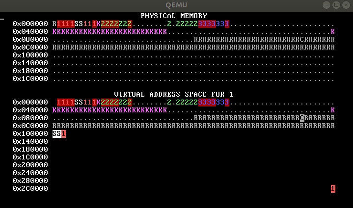

Note that your output will not have `S` characters until Step 7.

A fully correct OS can run `p-forkexit` indefinitely. An OS with a memory leak will display a persistent blank spot in the physical memory map - the leaked page - and if run long enough, blank spots will take over the screen. This OS has a pretty bad leak; within 10 seconds it has run out of memory:

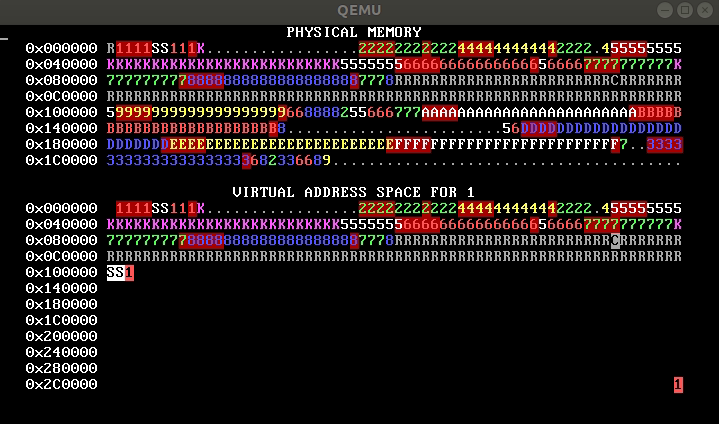

This OS's leak is slower, but if you look at the bottom row of the physical memory map, you should see a persistently unused pages just above and to the left of the "V" in "VIRTUAL". Persistently unused pages are a hallmark of leaks.

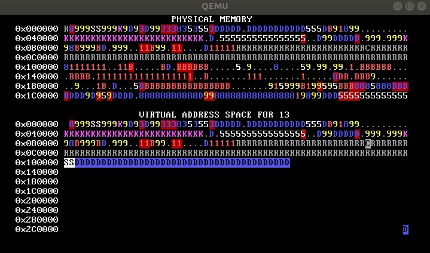

Reducing `ALLOC_SLOWDOWN` in `p-forkexit` may encourage errors to manifest, but you may need to be patient.

Here's your task.

1. Complete `kfree` so that `kfree` frees memory. Make sure that `kalloc` can re-use freed memory.
2. `sys_exit` should mark a process as free and free all of its memory. This includes the process's code, data, heap, and stack pages, as well as the pages used for its page directory and page table pages. The memory should become available again for future allocations.
    - Use <a href="#about-vmiter">`vmiter`</a> and <a href="#about-ptiter">`ptiter`</a> to enumerate the relevant pages. But be careful not to free the console.
3. You will also need to change `fork` and perhaps other places. Think about all the places that allocate or share memory: what information must they maintain? In `p-forkexit`, unlike in previous parts of the pset, `sys_fork` and `sys_page_alloc` can run when there isn't quite enough memory to create a new process or allocate or map a page. Your code should handle this cleanly, without leaking memory in any situation.
    - If there isn't enough free memory to successfully complete `sys_page_alloc`, the system call should return `-1` to the caller.
    - If there isn't enough free memory to successfully complete `sys_fork`, the system call should clean up (i.e., free any memory that was allocated for the new process before memory ran out), mark the possibly-partially-initialized child process as free, and then return `-1` to the parent.
    - If any allocation or mapping in `sys_page_alloc` or `sys_fork` fails, then the whole function must fail cleanly, leaving the state of allocated memory unchanged. When this happens, your code must clean up any previous "successful" allocations before returning `-1` or there will be a memory leak. Be careful. Note that allocation failures should not exit the calling process!

**There should be no memory leaks!**

<details>
<summary>About physical memory iterators (`ptiter`)</summary>

The `ptiter` type iterates through *the physical memory used to represent* a page table. (x86-64 page tables are hierarchical structures that can comprise multiple pages of memory.) `ptiter` is useful mostly when freeing page table structures.

```c
class ptiter {
public:
    // initialize a `ptiter` for `pt`
    inline ptiter(x86_64_pagetable* pt);
    inline ptiter(const proc* p);

    // Return kernel-accessible pointer to current page table page.
    inline x86_64_pagetable* kptr() const;
    // Return physical address of current page table page.
    inline uintptr_t pa() const;
    // Return first virtual address mapped by this page table page.
    inline uintptr_t va() const;
    // Return one past the last virtual address mapped by this page table page.
    inline uintptr_t last_va() const;

    // Move to next page table page in depth-first order.
    inline void next();

    // ...
};
```

`ptiter` visits the *individual page table pages* in a multi-level page table, in depth-first order (so all level-1 page tables under a level-2 page table are visited before the level-2 is visited). A `ptiter` loop can easily visit all the page table pages owned by a process, which is usually at least 4 page tables in x86-64 (one per level):

```c
for (ptiter it(pt); it.va() < MEMSIZE_VIRTUAL; it.next()) {
    log_printf("[%p, %p): level-%d ptp at pa %p\n",
               it.va(), it.last_va(), it.level() + 1, it.kptr());
}
```

A WeensyOS process might print the following:

    [0x0, 0x200000): level-1 ptp at pa 0x58000
    [0x200000, 0x400000): level-1 ptp at pa 0x59000
    [0x0, 0x40000000): level-2 ptp at pa 0x57000
    [0x0, 0x8000000000): level-3 ptp at pa 0x56000

Note the depth-first order: the level-1 page table pages are visited first, then level-2, then level-3. This makes it safe to use a `ptiter` to free the pages in a page table. `ptiter` never visits the topmost page table page, so that must be freed separately. Note also that `ptiter::level` is one less than you might expect (it returns a number between 0 and 3, rather than between 1 and 4).

</details>

Step 7: Shared read-only memory
-------------------------------

It's wasteful for `fork()` to copy *all* of a process's memory. For example, most processes, including `p-fork`, never change their code. So what if we shared the memory containing the code? That'd be fine for process isolation, as long as neither process could write the code.

Change `process_setup` to map *read-only* program segments using read-only memory. Use the <a href="#about-segments">`seg.writable()` function</a> to detect whether a program segment can use read-only memory. Then, in `fork`, share read-only pages between processes rather than copying them; and, in `exit`, ensure that shared pages are correctly accounted for when a process exits.

When you're done, running `p-fork` should look like this:

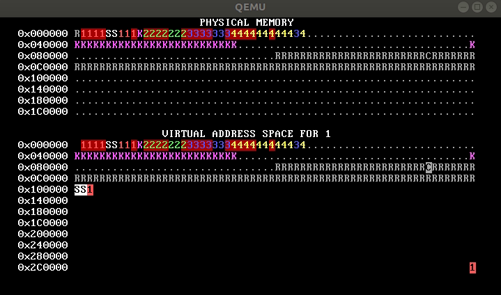

Each process's virtual address space begins with an "S", indicating that the corresponding physical page is `S`hared by multiple processes.

Additional Tasks
----------------

If you are finished and can't wait to do more of this type of work, try:

- Copy-on-write page allocation!
- Write more system calls and test programs! Some ideas:
    - `sys_page_alloc` is like a restricted `mmap` system call: the user
always defines where the page lives (so `addr == nullptr` is not
supported), the system call allocates exactly one page (so `sz == PAGESIZE` always), and the map is copied when a process forks (so the
flags are like `MAP_ANON | MAP_PRIVATE` and the protection is `PROT_READ | PROT_WRITE | PROT_EXEC`). Eliminate some of these restrictions by
passing more arguments to the kernel and extending the
`SYSCALL_PAGE_ALLOC` implementation.
    - Implement `sys_page_free`/`munmap`.
    - Implement a system call that puts the calling process to sleep until a
given amount of time has elapsed, as measured by `ticks` (which counts
timer interrupts).
    - Implement a `kill` system call that lets one process kill others!

You will need to write a new test program to test this functionality.

<details>
<summary>How to write a new test program</summary>

1. Choose a name for your test program. We'll assume `testprogram` for this example.
2. Create a C++ file `p-testprogram.cc` for your test program. You will base this file off one of the existing programs (`p-allocator.cc`, `p-fork.cc`, or `p-forkexit.cc`).
3. Teach `check_keyboard` in `k-hardware.cc` about your program. Pick a keystroke that should correspond to your program and edit the "soft reboot process" accordingly. For instance:

```c
if (c == 'a' || c == 'f' || c == 'e' || c == 't') { ...
    if (c == 'a') {
        argument = "allocators";
    } else if (c == 'e') {
        argument = "forkexit";
    } else if (c == 't') {
        argument = "testprogram";
    }
```

4. Run `make clean` and `make`. This will build the test program into your kernel.

</details>

Now you should be able to run your test program with `make run` and typing `t`.
